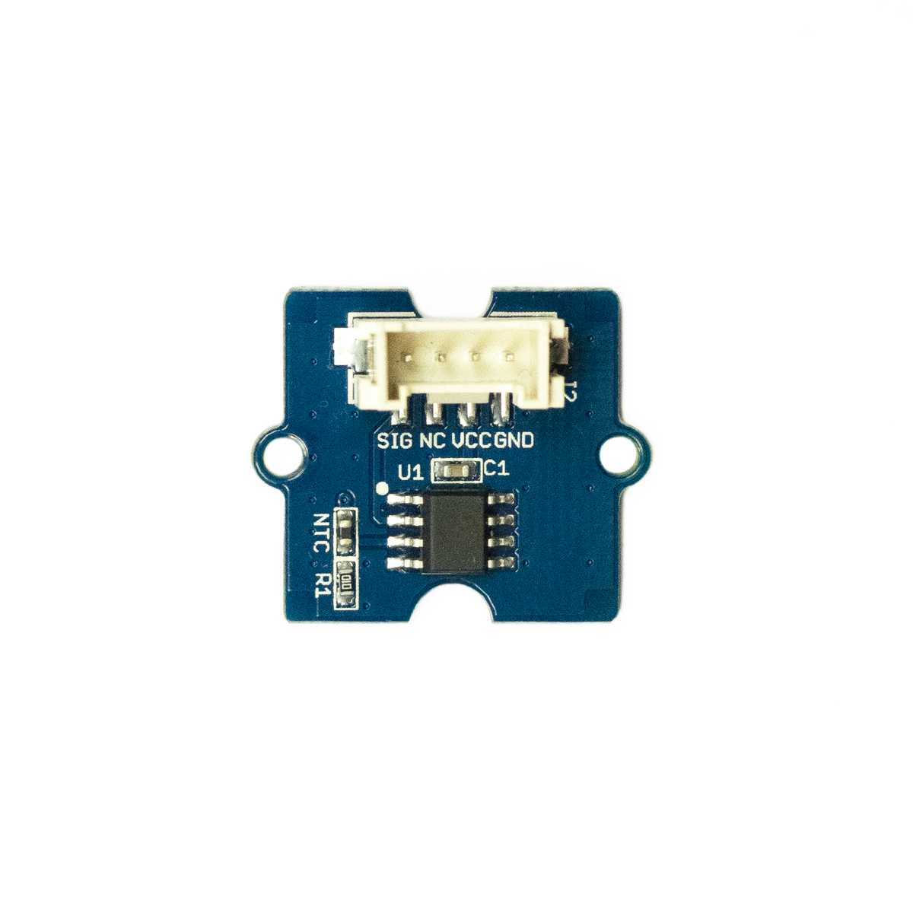

# Temperatursensor

## Beschreibung
Der Temperatursensors misst die Temperatur mit einem sogenannten Thermistor. Dies ist ein elektrischer Widerstand, der sich ändert, je nachdem welche Temperatur ihn umgibt.  Mit einer entsprechenden Schaltung wird diese Widerstandsänderung in eine analoge Spannung umgewandelt. Diese analoge Spannung kann von einem Mikrocontroller ausgelesen werden. Schließlich kann über mathematische Zusammenhänge die Temperatur ausgerechnet werden. Dieser Temperatursensor erfasst Temperaturen zwischen -40 °C und 125 °C und verfügt über eine Genauigkeit von  1,5 °C.

Der Sensor kann direkt oder mithilfe des Grove Shields an einen Arduino angeschlossen werden. Um den Sensor an einen Raspberry Pi anzuschließen, wird das Grove Shield benötigt. Der Sensor kommuniziert über einen analogen Pin.

Das Modul wird beispielsweise in einer Messstation für Umweltdaten, wie Feinstaub, Lautstärke, Luftfeuchtigkeit, Temperatur und UV-Strahlung eingesetzt.

Alle weiteren Hintergrundinformationen sowie ein Beispielaufbau und alle notwendigen Programmbibliotheken sind auf dem offiziellen Wiki (bisher nur in englischer Sprache) von Seeed Studio zusammengefasst. Zusätzlich findet man über alle gängigen Suchmaschinen durch die Eingabe der genauen Komponentenbezeichnung entsprechende Projektbeispiele und Tutorials.

<!-- infolist -->
## Wichtige Links für die ersten Schritte:

- [Seeed Studio Wiki – Temperatursensor v1.2](http://wiki.seeedstudio.com/Grove-Temperature_Sensor_V1.2/)

## Projektbeispiele:

- [Instructables – Groove Temperature Sensor with Arduino UNO](https://www.instructables.com/id/Interface-Groove-Temperature-Sensor-With-Arduino-U/)

## Weiterführende Hintergrundinformationen:

- [Thermistor – Wikipedia Artikel](https://de.wikipedia.org/wiki/Thermistor)
- [GitHub-Repository: Temperatursensor](https://github.com/MakeYourSchool/4-Temperatursensor)

